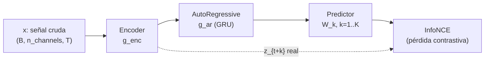
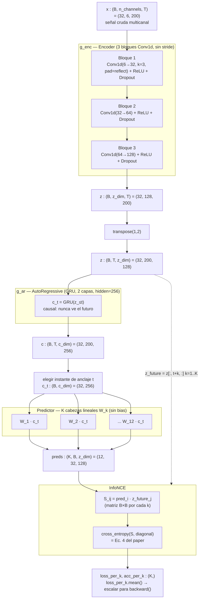

# Resumen: `02_Pipeline_CPC.ipynb`

Notas de estudio sobre la implementación de **Contrastive Predictive Coding (CPC)** en
[`02_Pipeline_CPC.ipynb`](02_Pipeline_CPC.ipynb), adaptado de:

- **Arquitectura base:** van den Oord, Li & Vinyals (2018), *Representation Learning with Contrastive
  Predictive Coding*, arXiv:1807.03748.
- **Adaptación a sensores corporales (referencia de este notebook):** Haresamudram, Essa & Plötz (2020),
  *Contrastive Predictive Coding for Human Activity Recognition*, arXiv:2012.05333.

---

## 1. Qué implementa el notebook (visión general)

El notebook construye, como **clases de PyTorch genéricas** (no atadas a ningún dataset concreto), las
4 piezas del pre-entrenamiento autosupervisado de CPC — es decir, la **parte 1 de la Figura 1** del paper
de Haresamudram et al.:

```
Encoder (g_enc)  →  AutoRegressive (g_ar)  →  Predictor (W_k)  →  InfoNCE (pérdida)
```

Todo se ensambla al final en una sola clase, `CPCModel`. El notebook **no incluye todavía**: datos reales,
bucle de entrenamiento, backend de clasificación (parte 2 de la Fig. 1) ni evaluación — ver §5.

---

## 2. Diagrama del pipeline

### 2.1 Vista de alto nivel



### 2.2 Vista detallada, con formas de tensores (demo: `B=32`, `n_channels=6`, `T=200`, `K=12`)



### 2.3 El detalle de un solo `S_ij` (la matriz de scores, para un horizonte `k` fijo)

```
              z_future_0   z_future_1   ...   z_future_31   ← futuro REAL de cada secuencia
pred_0      [   S_00  ←positivo   S_01          ...    S_0,31  ]
pred_1      [   S_10          S_11 ←positivo    ...    S_1,31  ]
  ...       [   ...            ...              ...     ...    ]
pred_31     [   S_31,0        S_31,1            ...  S_31,31 ←positivo ]
```

- **Diagonal (`S_ii`):** ¿qué tan bien predijo la secuencia `i` **su propio** futuro? → par positivo.
- **Fuera de la diagonal:** ¿qué tan bien "encaja" la predicción de `i` con el futuro de otra secuencia `j`?
  → pares negativos (los distractores de "negativos de minibatch").
- `cross_entropy(S, target=arange(B))` = tratar cada fila como logits de una clasificación de `B` clases,
  donde la clase correcta es la diagonal. Esto **es** la Ec. 4 del paper (InfoNCE), no una aproximación.

---

## 3. Resumen por componente

### 3.1 `CPCConfig`
`dataclass` con todos los hiperparámetros (nada de valores *hardcoded* dentro de las clases). Expone dos
propiedades derivadas: `z_dim` (= último elemento de `enc_channels`, 128) y `c_dim` (= `ar_hidden_size`, 256).

### 3.2 `Encoder` (`g_enc`)
- 3 bloques `Conv1d → ReLU → Dropout`, canales `n_channels→32→64→128`.
- **Sin stride** (a diferencia del CPC de audio original, que sí submuestrea): apropiado porque los
  sensores corporales ya están a baja frecuencia (30 Hz en el paper) y no "sobra" resolución temporal.
- **Padding `reflect`, tamaño `k//2`** ("same"): conserva `T` de entrada a salida sin introducir ceros
  artificiales en los bordes.
- Los canales de salida (32, 64, 128) son *filtros aprendidos*, no sensores físicos: cada capa combina los
  patrones de la anterior en combinaciones más numerosas y abstractas. Los valores exactos vienen del paper
  (no derivados por nosotras).
- `forward`: aplica los 3 bloques en cadena sobre `x` completo; PyTorch vectoriza la operación sobre las
  `B` secuencias y sobre los `T` pasos de tiempo a la vez (no hay loop manual sobre el tiempo).

### 3.3 `AutoRegressive` (`g_ar`)
- `nn.GRU` de 2 capas, `hidden_size=256` (= `c_dim`), dropout 0.2 entre capas.
- Requiere `batch_first=True` y que la entrada venga como `(B, T, z_dim)` — por eso el `transpose(1,2)`
  antes de llamarla (el `Encoder` entrega `(B, z_dim, T)`, convención de `Conv1d`).
- Devuelve `c`, la secuencia **completa** de contextos por cada instante (no solo el último).
- Propiedad clave: **causalidad** — `c_t = g_ar(z_{≤t})`, nunca ve el futuro. Es indispensable para que
  predecir `z_{t+k}` desde `c_t` sea una tarea no trivial.

### 3.4 `Predictor` (`W_k`)
- `K` capas `nn.Linear(c_dim, z_dim, bias=False)` **independientes**, una por horizonte `k=1..K`.
- **La matriz `W_k` del paper ES el atributo `.weight`** de cada `nn.Linear` (forma `(z_dim, c_dim)`); no
  hay ninguna otra representación explícita en el código. `self.heads[k-1].weight` = `W_k`.
- `bias=False` porque la Ec. 3 del paper es puramente bilineal: `f_k = exp(z_{t+k}ᵀ W_k c_t)`, sin término
  aditivo.
- Deliberadamente simple (sin no-linealidades): el "trabajo pesado" de aprender features debe recaer en
  `Encoder`/`AutoRegressive`, no en el predictor.
- `forward(c_t)` devuelve las `K` predicciones apiladas: `(K, B, z_dim)`.

### 3.5 `InfoNCE`
- Implementa la Ec. 4 (softmax + cross-entropy sobre una matriz de scores `S_ij = pred_i · z_future_j`).
- Negativos = mismo instante `t+k`, **otras secuencias del mismo batch** (estrategia del paper).
- Generaliza el cálculo manual (hecho primero "a mano" en el notebook, para un `k` fijo) a los `K`
  horizontes de una vez, con un `for k in range(1, K+1)` interno.
- Devuelve `loss_per_k` y `acc_per_k` (uno por horizonte, para diagnosticar/graficar) además del escalar
  promedio para entrenar.
- El nombre viene de **Info**rmación (mutua) + **NCE** (*Noise Contrastive Estimation*, Gutmann &
  Hyvärinen 2010): la pérdida se justifica como una cota inferior de información mutua,
  `I(x_{t+k}, c_t) ≥ log(N) − L_N`.

### 3.6 `CPCModel`
- Ensambla las 4 piezas anteriores como submódulos de un solo `nn.Module`.
- `encode(x)`: `Encoder` + `transpose` + `AutoRegressive`, en un solo paso.
- `info_nce(x, anchors=None)`: orquesta todo —
  1. codifica `x` → `z, c`;
  2. calcula el rango válido de instantes de anclaje `[lo, hi)` (`hi = L−K` para que exista `z_{t+K}`
     dentro de la ventana; `lo = L//8`, decisión propia para asegurar contexto mínimo en `g_ar`);
  3. sortea `cfg.n_anchors` anclajes (extensión propia: el paper describe un solo anclaje por vez);
  4. para cada anclaje, calcula `Predictor` + `InfoNCE`;
  5. promedia pérdida/accuracy sobre anclajes y horizontes.
- Es el equivalente al **forward pass** de una iteración de entrenamiento — falta envolverlo en un loop con
  optimizador (ver §5).

---

## 4. Aclaraciones puntuales que surgieron en la revisión

- **`B` y `T`:** `B` = cuántas ventanas se procesan en paralelo (también determina cuántos negativos hay en
  InfoNCE, `N = B`); `T` = longitud temporal de cada ventana (en el paper, 1 s a 30 Hz).
- **Stride:** cuántos pasos avanza el kernel de la convolución; aquí `stride=1` para conservar resolución
  temporal completa.
- **Padding "same" + `reflect`:** rellena los bordes lo justo para que `T` no cambie, reflejando la señal
  en vez de rellenar con ceros (evita artefactos espurios en los bordes).
- **Progresión de canales `6→32→64→128`:** el primer número (6) lo impone el dato (nº de sensores/canales
  crudos); los siguientes (32,64,128) son hiperparámetros tomados literalmente del paper — número de
  filtros aprendidos, no de "sensores".

---

## 5. Qué le falta al notebook para ser el pipeline **completo** del paper

(Detalle ya discutido en la revisión general — se deja aquí como referencia rápida.)

1. **Datos reales.** Todo corre sobre `x_demo = torch.randn(...)`. Falta: downsample a 30 Hz (o la
   frecuencia real de tu EMG), normalización por canal con estadísticas de train, ventaneo 1 s / 50% de
   solape, split por sujeto.
2. **Bucle de entrenamiento.** No hay optimizador (`Adam`), ni las 150 épocas, ni el barrido de
   `lr ∈ {1e-3, 5e-4}` / `k ∈ {2,4,8,12,16}` del paper (Sección 4.2.2).
3. **Backend de clasificación (Sección 3.2 / parte 2 de la Fig. 1).** Falta el MLP de 3 capas
   (256, 128, softmax) con BatchNorm+ReLU+Dropout 0.2 que se entrena sobre `g_enc`/`g_ar` congelados —
   sin esto no se puede reproducir la Tabla 2 (F1 macro) ni la Figura 2 (pocas etiquetas por clase).
4. **Métrica de evaluación** (F1 macro) y experimentos de pocas muestras por clase.
5. **Ablaciones** (elección de encoder, número de `k`, qué pesos congelar) — opcional, no imprescindible
   para un pipeline base.

### Dos desviaciones menores de diseño (documentadas, no errores)

- `n_anchors=4` por batch en vez de un solo anclaje (el paper describe uno).
- `lo = L // 8` como límite inferior del rango de anclaje (el paper permite `t=0`).

---

## 6. Tabla resumen de formas, de punta a punta (valores de la demo)

| Etapa | Tensor | Forma |
|---|---|---|
| Entrada | `x` | `(32, 6, 200)` = `(B, n_channels, T)` |
| Salida `Encoder` | `z` (antes de transpose) | `(32, 128, 200)` = `(B, z_dim, T)` |
| Tras `transpose(1,2)` | `z` | `(32, 200, 128)` = `(B, T, z_dim)` |
| Salida `AutoRegressive` | `c` | `(32, 200, 256)` = `(B, T, c_dim)` |
| Contexto en un anclaje `t` | `c_t` | `(32, 256)` = `(B, c_dim)` |
| Salida `Predictor` | `preds` | `(12, 32, 128)` = `(K, B, z_dim)` |
| Matriz de scores (por `k`) | `S` | `(32, 32)` = `(B, B)` |
| Pérdida/acc por horizonte | `loss_per_k`, `acc_per_k` | `(12,)` = `(K,)` |
| Pérdida final (para `backward()`) | escalar | `()` |
