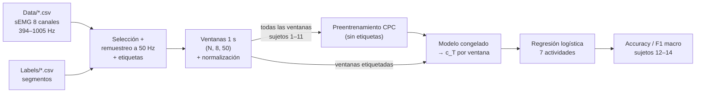
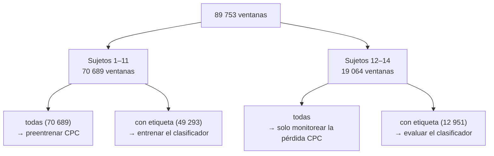

# Resumen: `03_Pipeline_CPC_sEMG.ipynb`

Notas de estudio sobre el pipeline **completo** de Contrastive Predictive Coding (CPC) aplicado a las
señales **sEMG reales** del dataset, en
[`notebooks/03_Pipeline_CPC_sEMG.ipynb`](../notebooks/03_Pipeline_CPC_sEMG.ipynb).

- **Modelo:** las clases de [`01_Pipeline_CPC.ipynb`](../notebooks/01_Pipeline_CPC.ipynb) (resumidas en
  [`resumen_notebook_02_Pipeline_CPC.md`](resumen_notebook_02_Pipeline_CPC.md)), con una corrección (§3.7).
- **Referencia del método:** Haresamudram, Essa & Plötz (2020), *Contrastive Predictive Coding for Human
  Activity Recognition*, arXiv:2012.05333.
- **Datos:** Bassani, Filippeschi & Avizzano (2021), *Manual Material Handling Dataset for Biomechanical and
  Ergonomics Analysis*, [Zenodo 4633087](https://zenodo.org/records/4633087). Estructura de carpetas en el
  [README](../README.md#datos); contenido de cada carpeta en `02_Contenido_datos_unzipped.ipynb`.

---

## 1. Qué hace el notebook (visión general)

El notebook 01 construyó las piezas de CPC y las probó con **ruido aleatorio** (`x_demo`). El notebook 03
cierra el ciclo completo que describe el paper (Fig. 1):

1. **Preparar datos reales:** leer los CSV de sEMG, unificar la frecuencia, cortar en ventanas, normalizar.
2. **Preentrenar CPC sin etiquetas** (parte 1 de la Fig. 1): el modelo aprende a predecir el futuro de la
   señal.
3. **Evaluar lo aprendido con etiquetas** (partes 2 y 3 de la Fig. 1): congelar el modelo, extraer una
   representación por ventana y clasificar las 7 actividades.

| | Notebook 01 | Notebook 03 |
|---|---|---|
| Entrada | `x_demo = torch.randn(32, 6, 200)` | Ventanas reales de sEMG `(N, 8, 50)` |
| Clases CPC | Definidas aquí | Copiadas del 01 (con 1 corrección) |
| Entrenamiento | No (solo una pasada para ver formas) | Sí: Adam, 15 épocas |
| Clasificación de actividades | No | Sí: regresión logística sobre representaciones congeladas |
| Métrica | – | Accuracy y F1 macro, por sujeto |

---

## 2. Diagrama del pipeline

### 2.1 Vista de alto nivel



### 2.2 Quién usa qué datos



Los sujetos 12–14 **nunca** se usan para ajustar pesos (ni de CPC ni del clasificador), ni para calcular la
normalización. Así los resultados miden cómo funciona el sistema con **personas nuevas**.

---

## 3. Paso a paso

### 3.1 Setup (sección 1 del notebook)

Fija la semilla (`SEED = 0`), detecta el dispositivo (**MPS** en Mac con Apple Silicon, CUDA o CPU) y define
todas las constantes en un solo lugar:

| Constante | Valor | Significado |
|---|---|---|
| `SIGNAL_COLS` | `Norm_RMS_1..8` | Columnas de señal que se usan |
| `FS_TARGET` | 50 | Frecuencia tras el remuestreo (Hz) |
| `WIN` | 50 | Muestras por ventana → 1 s a 50 Hz |
| `STEP` | 25 | Salto entre ventanas → 50 % de traslape |
| `TEST_SUBJECTS` | `[12, 13, 14]` | Sujetos reservados para la evaluación |
| `EPOCHS` | 15 | Épocas de preentrenamiento |
| `BATCH_SIZE` | 64 | Ventanas por batch (y candidatos por predicción en InfoNCE) |
| `LR` | 5e-4 | Tasa de aprendizaje de Adam |
| `LABELS` | `N, LF, K, PT, LT, W, PF` | Las 7 actividades, en orden fijo |
| `UNLABELED` | -1 | Código para muestras fuera de cualquier segmento |
| `REFRESH` | `False` | `True` obliga a releer los CSV ignorando la caché |

### 3.2 Selección de archivos (sección 2.1)

De los 679 CSV de `Data/`:

1. Se quitan los **36 archivos MVC** (contracción voluntaria máxima). Son la referencia para normalizar a
   %MVC y no tienen etiquetas de actividad. Quedan **643** pruebas: `Isokin`, `MMH_Bim` y `MMH_One`.
2. Se quitan los mismos archivos defectuosos que detectó el EDA (`00_EDA_dataset.ipynb`):

| Motivo | Regla | Archivos |
|---|---|---|
| Señal rota (electrodo suelto o saturado) | Algún canal con desviación estándar cruda > 50 mV (el valor típico es ~1 mV). Se lee de `_cache/emg_file_stats.csv`, que generó el EDA | `Subj_07_MMH_Bim_R_08kg_Trial_3`, `Subj_07_MMH_Bim_R_12kg_Trial_1`, `Subj_07_MMH_Bim_R_12kg_Trial_2` |
| Etiquetas inconsistentes | Algún segmento vacío o invertido (`End ≤ Start`) o que se traslapa con el siguiente | `Subj_02_MMH_One_R_02kg_Trial_2`, `Subj_05_Isokin_L_04kg_80bpm` |

Resultado: **638 pruebas** (222 `Isokin`, 249 `MMH_Bim`, 167 `MMH_One`).

### 3.3 Carga y remuestreo a 50 Hz (sección 2.2, función `load_trial`)

**Problema:** cada CSV tiene su propia frecuencia de muestreo (de 394 a 1005 Hz, mediana 530 Hz). Una red
convolucional interpreta "5 muestras" como una duración fija, así que sin unificar la frecuencia la misma
actividad se vería más rápida o más lenta según el archivo.

Para cada prueba, `load_trial`:

1. **Lee** solo `Time` y `Norm_RMS_1..8`.
2. **Estima la frecuencia** como en `Process.m`: `fs = número de filas / duración en segundos`.
3. **Marca la etiqueta de cada fila.** Cada renglón de `Labels/` (`Start_Frame`, `End_Frame`, `Label`) pinta
   esas filas con el código de la actividad; las filas fuera de cualquier segmento quedan en `-1`.
4. **Construye una rejilla uniforme a 50 Hz.** La muestra nueva `j` cae en la posición `j · fs / 50` de la
   señal original (normalmente entre dos filas).
5. **Interpola** cada canal en esas posiciones (`np.interp`, interpolación lineal).
6. **Copia la etiqueta** de la fila original más cercana.

**Ejemplo numérico.** Una prueba de 60 s grabada a 530 Hz tiene ~31 800 filas:

- A 50 Hz queda en `int(31 799 · 50 / 530) + 1 = 3 000` muestras.
- La muestra nueva `j = 100` (t = 2.0 s) sale de la posición `100 · 530 / 50 = 1 060` de la original.
- Un segmento con `Start_Frame = 14 402` en un archivo a 900 Hz empieza en t = 16.0 s, que a 50 Hz es la
  muestra 800.

**¿Por qué no hace falta filtro anti-aliasing?** Al bajar la frecuencia, cualquier componente por encima de
la mitad de la nueva frecuencia (25 Hz) se "dobla" y contamina la señal. `Norm_RMS` ya es una envolvente RMS
calculada sobre 250 muestras (un promedio móvil de ~0.25–0.6 s), así que no tiene contenido de alta
frecuencia. Esto **no** valdría para `Raw_V` o `Norm_V`.

**Resultado:** 2 267 511 muestras × 8 canales = **12.6 h de registro**; el **69 %** de las muestras cae
dentro de un segmento etiquetado. El resto son tramos al inicio y al final de cada prueba.

### 3.4 Caché (sección 2.2)

Leer los 638 CSV (10 GB) es lo más lento. La primera ejecución lo hace **en paralelo** con `joblib` (un
proceso por núcleo) y guarda el resultado en `notebooks/_cache/semg_norm_rms_50hz.npz`:

| Arreglo | Forma | Contenido |
|---|---|---|
| `signals` | `(2 267 511, 8)` | Todas las pruebas remuestreadas, una tras otra |
| `labels` | `(2 267 511,)` | Etiqueta de cada muestra (`-1` = sin etiqueta) |
| `offsets` | `(639,)` | Dónde empieza cada prueba: la prueba `i` es `signals[offsets[i]:offsets[i+1]]` |
| `fs` | `(638,)` | Frecuencia original de cada prueba |
| `files` | `(638,)` | Nombre de cada prueba, para verificar que la caché corresponde a la lista actual |

Las siguientes ejecuciones cargan este archivo en segundos. Si cambia la lista de archivos (por ejemplo, otra
regla de exclusión), el `assert` obliga a usar `REFRESH = True`. La caché está ignorada por git: cada
colaborador la genera en su equipo.

La figura de esta sección muestra una prueba bimanual ya remuestreada: los 8 canales, líneas verticales en
cada cambio de actividad y sombreado donde no hay etiqueta. Ahí se ve cómo la envolvente sube al levantar
(`LF`, `LT`) y baja en reposo (`N`).

### 3.5 Ventanas de 1 s (sección 3.1)

Cada prueba se corta en ventanas de 50 muestras, avanzando 25 cada vez. Una prueba de 3 000 muestras da
`(3 000 − 50) / 25 + 1 = 119` ventanas. Las ventanas **nunca cruzan** de una prueba a otra.

Cada ventana guarda:

- `X`: la señal, transpuesta a `(canales, tiempo) = (8, 50)`, que es el formato que espera `Conv1d`.
- `y`: la etiqueta **mayoritaria**, solo si esa actividad ocupa al menos 25 de las 50 muestras; si no, `-1`.
  Así se descartan ventanas de transición donde ninguna actividad domina.
- `subj` y `task`: sujeto y tipo de prueba, para la partición.

| | Ventanas | Con etiqueta | Sujetos |
|---|---|---|---|
| Entrenamiento | 70 689 | 49 293 | 1–11 |
| Prueba | 19 064 | 12 951 | 12–14 |

Ventanas etiquetadas por clase (el desbalance que verá el clasificador):

| Actividad | Entrenamiento | Prueba |
|---|---|---|
| `N` N-pose (de pie, neutral) | 21 367 | 5 556 |
| `LF` Levantar del piso | 4 779 | 1 230 |
| `K` Mantener el objeto levantado | 4 333 | 916 |
| `PT` Colocar en la mesa | 7 125 | 2 061 |
| `LT` Levantar de la mesa | 4 400 | 1 269 |
| `W` Caminar / cargar | 3 774 | 1 015 |
| `PF` Colocar en el piso | 3 515 | 904 |

`N` es ~43 % de las ventanas: un clasificador que siempre dijera `N` tendría ~43 % de accuracy sin aprender
nada. Por eso la métrica principal es F1 macro (§3.9).

### 3.6 Normalización por canal (sección 3.2)

Cada canal se estandariza: `x_norm = (x − media) / desviación`. La media y la desviación se calculan **solo
con los sujetos de entrenamiento** y se aplican igual a los de prueba (como indica el paper). Si se usaran
todos los sujetos, información de los de prueba se filtraría al preprocesamiento.

Valores obtenidos (%MVC): medias de 20–26 y desviaciones de 26–39 según el canal. Una desviación mayor que la
media indica una distribución muy asimétrica: casi todo el tiempo cerca de 0–20 %MVC, con picos de más del
100 %.

### 3.7 El modelo CPC (sección 4)

Las seis clases (`CPCConfig`, `Encoder`, `AutoRegressive`, `Predictor`, `InfoNCE`, `CPCModel`) se copian del
notebook 01, sin sus demos. Su funcionamiento está explicado en
[`resumen_notebook_02_Pipeline_CPC.md`](resumen_notebook_02_Pipeline_CPC.md).

**Corrección en `InfoNCE.forward`.** En el notebook 01 la última línea era:

```python
return loss_per_k.mean(), loss_per_k.detach(), acc_per_k.detach()
```

`CPCModel.info_nce` no usa el primer valor: construye la pérdida final promediando el **segundo**
(`loss_per_k`). Como venía con `.detach()`, esa pérdida quedaba desconectada del grafo de gradientes, y al
entrenar `loss.backward()` fallaba con `element 0 of tensors does not require grad`. En el notebook 01 no se
notaba porque nunca entrena. En el 03 se devuelve `loss_per_k` sin `.detach()`; nada más cambia.

**Configuración:** `CPCConfig(n_channels=8, n_pred_steps=12, n_anchors=4)`. Solo cambia `n_channels` (8
electrodos en vez de 6); el resto son los valores del notebook 01 → **1.12 M parámetros**.

**Qué significa `K = 12` con estos datos:** cada paso dura 20 ms (1/50 Hz), así que el modelo predice desde
20 ms hasta **240 ms** hacia adelante.

**Rango de anclajes:** `lo = 50 // 8 = 6`, `hi = 50 − 12 = 38` → `t ∈ {6, …, 37}`, para que siempre haya
contexto previo y exista `z_{t+12}` dentro de la ventana.

**Comprobación inicial:** con un batch real y pesos aleatorios, InfoNCE da **4.159 = log(64)**. Es
exactamente lo esperado: sin entrenar, el modelo reparte la probabilidad por igual entre los 64 candidatos.

### 3.8 Preentrenamiento sin etiquetas (sección 5)

**Un paso de entrenamiento:**

1. Tomar 64 ventanas al azar de los sujetos 1–11 (tengan etiqueta o no).
2. `model.info_nce(xb)`: codificar → sortear 4 anclajes → predecir 12 horizontes → InfoNCE promediado.
3. `loss.backward()` + `optimizer.step()` (Adam, lr 5e-4).

**Una época** = `70 689 // 64 = 1 104` pasos (se descartan las 33 ventanas sobrantes). Todo el conjunto de
entrenamiento está en la memoria del dispositivo, así que no hay `DataLoader`: cada época se baraja con
`torch.randperm`.

**Monitoreo con sujetos de prueba (`evaluate_cpc`):** al final de cada época se mide InfoNCE en 100 batches
**fijos** de los sujetos 12–14, siempre con las mismas ventanas y los mismos anclajes, así los valores son
comparables entre épocas. Se usa solo para observar; no se elige ningún modelo con esto.

**Guardado:** `checkpoints/cpc_semg_norm_rms.pt` con los pesos, la configuración, la media y desviación de
normalización, la frecuencia, el tamaño de ventana y los sujetos de prueba: todo lo necesario para reusar el
modelo con datos nuevos. La carpeta está ignorada por git.

### 3.9 Evaluación: clasificación de actividades (sección 6)

Protocolo de **evaluación lineal**: el modelo CPC queda **congelado** (no se modifica) y solo se entrena un
clasificador encima. Si un clasificador *lineal* separa bien las actividades, la representación aprendida
sin etiquetas ya contiene esa información.

1. **Representación por ventana:** `c_T`, el contexto de la GRU en el último instante de la ventana (256
   valores). Como la GRU es causal, `c_T` resume la ventana completa.
2. **Tres representaciones que se comparan:**

| Representación | Dimensión | Para qué sirve |
|---|---|---|
| CPC preentrenado | 256 | Lo que se quiere evaluar |
| CPC sin entrenar | 256 | Misma arquitectura con pesos aleatorios: separa lo que aporta el **preentrenamiento** de lo que aporta la arquitectura por sí sola |
| Estadísticos simples | 32 | Media, desviación, mínimo y máximo de cada canal: una referencia clásica sin aprendizaje profundo |

3. **Clasificador:** `StandardScaler` + `LogisticRegression(class_weight="balanced")`, entrenado con las
   ventanas etiquetadas de los sujetos 1–11 y evaluado con las de los sujetos 12–14. `class_weight="balanced"`
   da más peso a los errores en clases poco frecuentes para que el modelo no se limite a predecir `N`.
4. **Métricas:**
   - **Accuracy:** fracción de ventanas bien clasificadas. Engañosa con clases desbalanceadas.
   - **F1 macro:** el F1 de cada clase, promediado **sin ponderar**. Cada actividad cuenta igual, sea
     frecuente o no. Es la métrica del paper.

---

## 4. Resultados (ejecución con 15 épocas)

### 4.1 Preentrenamiento

| Época | Pérdida (entren.) | Acc. contrastiva (entren.) | Pérdida (prueba) | Acc. contrastiva (prueba) |
|---|---|---|---|---|
| 1 | 2.115 | 0.335 | 1.692 | 0.591 |
| 5 | 0.720 | 0.773 | 0.978 | 0.773 |
| 10 | 0.478 | 0.849 | 0.748 | 0.814 |
| 15 | 0.403 | 0.870 | 0.707 | 0.815 |
| *Azar* | *4.159* | *0.016* | *4.159* | *0.016* |

- El modelo **aprende la tarea contrastiva**: en sujetos nuevos, reconoce el futuro correcto entre 64
  candidatos el 81.5 % de las veces (azar: 1.6 %).
- **Generaliza a sujetos nuevos:** las curvas de prueba siguen a las de entrenamiento. Desde la época ~9 la
  pérdida de prueba se estabiliza entre 0.71 y 0.77: más épocas probablemente aportarían poco con esta
  configuración.
- **Cuanto más lejos, más difícil:** la accuracy de prueba baja de ~0.95 en `k = 1` (20 ms) a ~0.67 en
  `k = 12` (240 ms), como en la Fig. 3 del paper.

### 4.2 Clasificación de las 7 actividades (sujetos 12–14)

| Representación | Accuracy | F1 macro |
|---|---|---|
| CPC preentrenado | 0.385 | **0.290** |
| CPC sin entrenar | 0.422 | 0.268 |
| Estadísticos simples | 0.476 | 0.292 |
| *Azar (7 clases)* | – | *~0.14* |

F1 por clase con CPC preentrenado: `N` 0.63 · `LT` 0.27 · `PF` 0.27 · `LF` 0.26 · `PT` 0.24 · `W` 0.22 ·
`K` 0.14.

**Lectura honesta:** todas las representaciones superan al azar, pero **el preentrenamiento casi no mejora la
clasificación**: +0.02 de F1 sobre la misma red sin entrenar, e igual que los estadísticos simples. CPC
aprendió a predecir la señal, pero eso todavía no se traduce en distinguir actividades. La matriz de
confusión muestra por qué:

- `N` es la única clase bien reconocida (recall 0.53).
- Las actividades que difieren sobre todo por **la altura** se confunden entre sí: `LT` se predice como `LF`
  el 26 % de las veces, y `PT` como `PF` el 31 %. La activación de los músculos del brazo es parecida al
  levantar del piso o de la mesa; lo que cambia es la postura del cuerpo.
- `K` (mantener) y `W` (caminar cargando) se reparten entre casi todas las clases: en 1 s de envolvente se
  ven como "esfuerzo sostenido", sin rasgo distintivo.

**Causas probables** (hipótesis, aún no probadas):

1. **Ventanas de 1 s:** una actividad como `LF` dura varios segundos; 1 s puede capturar solo una parte.
2. **Poca información en la señal:** 8 envolventes RMS dicen *cuánto* se activa cada músculo, no *cómo* se
   mueve el cuerpo. La altura, clave para separar `LF`/`LT` y `PT`/`PF`, está en la captura de movimiento
   (MVNX).
3. **Evaluación limitada:** solo `c_T` y un clasificador lineal; el paper usa un MLP de 3 capas.
4. **Hiperparámetros sin ajustar:** 15 épocas frente a las 150 del paper, con `lr` y `K` fijos. Como la
   pérdida de prueba ya se estabilizó, entrenar más con la misma configuración probablemente no baste; tendría
   que combinarse con otros cambios.

---

## 5. Tabla de formas, de punta a punta

| Etapa | Tensor | Forma |
|---|---|---|
| Señal remuestreada (todas las pruebas) | `signals` | `(2 267 511, 8)` = (muestras, canales) |
| Todas las ventanas | `X`, `Xn` | `(89 753, 8, 50)` = (N, canales, T) |
| Ventanas de entrenamiento en el dispositivo | `X_train_t` | `(70 689, 8, 50)` |
| Un batch | `xb` | `(64, 8, 50)` = (B, n_channels, T) |
| Salida del `Encoder` | `z` | `(64, 128, 50)` → transpose → `(64, 50, 128)` = (B, T, z_dim) |
| Salida de `AutoRegressive` | `c` | `(64, 50, 256)` = (B, T, c_dim) |
| Contexto en un anclaje `t` | `c[:, t, :]` | `(64, 256)` |
| Salida del `Predictor` | `preds` | `(12, 64, 128)` = (K, B, z_dim) |
| Matriz de scores (por `k`) | `S` | `(64, 64)` = (B, B) |
| Pérdida / accuracy por horizonte | `loss_per_k`, `acc_per_k` | `(12,)` |
| Representación para clasificar | `c_T` = `c[:, -1, :]` | `(N, 256)` |
| Estadísticos simples | `stat_features(Xn)` | `(N, 32)` = 4 estadísticos × 8 canales |

Diferencias con la demo del notebook 01: `B` 32 → 64, `n_channels` 6 → 8, `T` 200 → 50.

---

## 6. Aclaraciones

- **Frames, filas y muestras:** en `Labels/`, "frame" es un índice de fila del CSV de sEMG. Tras el
  remuestreo se habla de "muestras" a 50 Hz; `load_trial` convierte unas en otras.
- **%MVC:** porcentaje de la contracción voluntaria máxima de esa persona en ese músculo. 50 %MVC = el
  músculo trabaja a la mitad de su máximo. Permite comparar entre personas con distinta fuerza.
- **Por qué `log(64)` es "azar":** con 64 candidatos y probabilidad uniforme, la cross-entropy vale
  `−log(1/64) = log(64) ≈ 4.16`.
- **Por qué la accuracy de prueba supera a la de entrenamiento en las primeras épocas:** la de entrenamiento
  se promedia **durante** la época, con *dropout* activo y mientras el modelo todavía mejora; la de prueba se
  mide **al final**, con el modelo en modo evaluación (sin dropout). No indica ningún error.
- **Por qué `N` domina:** cada prueba empieza, alterna y termina en N-pose, y esos tramos son largos.
- **Accuracy contrastiva vs. accuracy de clasificación:** la primera mide si el modelo reconoce el futuro de
  **su propia ventana** entre 64; la segunda, si se puede adivinar **la actividad**. Son tareas distintas: la
  §4 muestra que se puede tener 81 % en la primera y ~39 % en la segunda.
- **Semilla:** fija el orden de los batches y la inicialización, pero en MPS algunas operaciones no son
  deterministas; los números pueden variar ligeramente entre ejecuciones.

---

## 7. Diferencias con el paper y qué falta

| Aspecto | Paper (Haresamudram et al.) | Notebook 03 |
|---|---|---|
| Sensores | Acelerómetro y giroscopio crudos | 8 envolventes sEMG (`Norm_RMS`) |
| Frecuencia | 30 Hz | 50 Hz (decisión propia) |
| Ventanas | 1 s, 50 % de traslape | Igual |
| Normalización | Por canal, con estadísticas de train | Igual |
| Épocas de preentrenamiento | 150 | 15 |
| `lr` y `K` | Barrido `lr ∈ {1e-3, 5e-4}`, `K ∈ {2, 4, 8, 12, 16}` | Fijos: 5e-4 y 12 |
| Batch | No se indica | 64 (decisión propia) |
| Anclajes por batch | 1, con `t ∈ [0, T − k]` | 4, con `t ∈ [6, 37]` (del notebook 01) |
| Clasificador | MLP de 3 capas, 150 épocas | Regresión logística |
| Partición | Train / validación / test por dataset | Una sola partición por sujeto (1–11 / 12–14) |

**Siguientes pasos posibles**, en orden de impacto esperado:

1. **Ventanas más largas** (2–3 s) o clasificar con el promedio de `c_t` de toda la ventana en vez de solo
   `c_T`.
2. **Clasificador MLP** como el del paper.
3. **Barrido de `lr` y `K`**, con más épocas (sola, la pérdida de prueba ya se estabilizó).
4. **Validación cruzada por sujeto** (varias particiones) para que el resultado no dependa de qué 3 sujetos
   quedaron en prueba.
5. **Añadir captura de movimiento** (`mvnx_files/`: aceleración y velocidad angular de los 17 sensores), que
   es el tipo de señal del paper y aporta la información de postura que el sEMG no tiene.
6. Probar `Norm_V` o `Raw_V` filtrada a mayor frecuencia.
